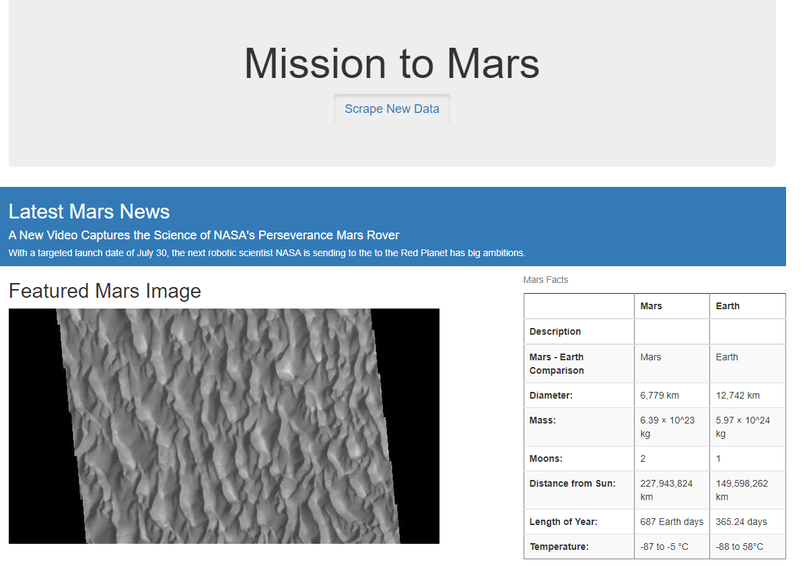

# Mission-To-Mars

## Background
Robin's web app is looking good and functioning well, but she wants to add more polish to it. She had been admiring images of Mars’s hemispheres online and realized that the site is scraping-friendly. She would like to adjust the current web app to include all four of the hemisphere images. To do this, you’ll use BeautifulSoup and Splinter to scrape full-resolution images of Mars’s hemispheres and the titles of those images, store the scraped data on a Mongo database, use a web application to display the data, and alter the design of the web app to accommodate these images.

## Visuals

### Normal Desktop View
 

*Normal size page with added blue colors, modified button, and modified header for table*

 

*Normal size page of rounded images*

### iPad View
 

*iPad page where columns are adjusted; colors and buttons are the same* 

 

*iPad page where columns are adjusted; rounded edges are the same*
